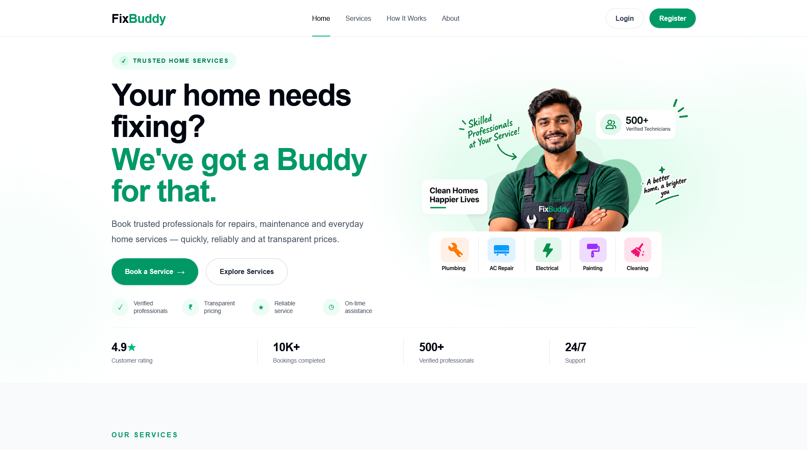
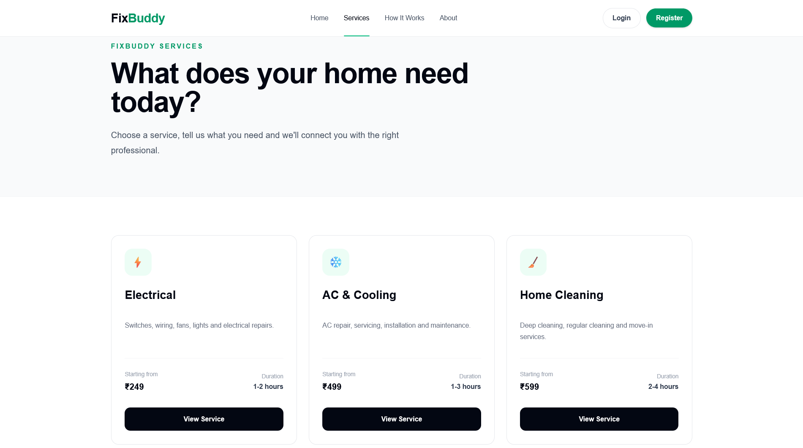
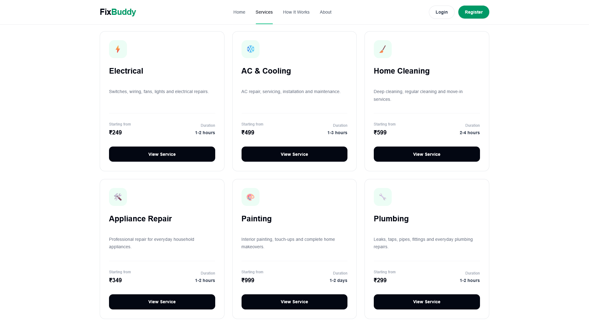
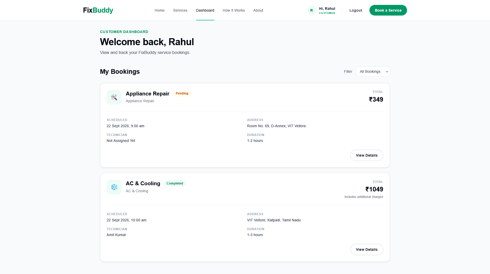
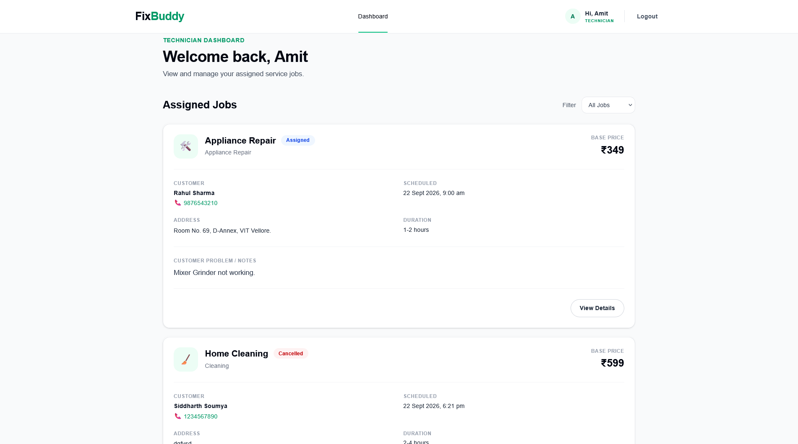
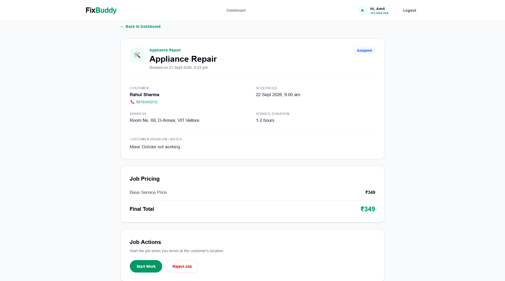
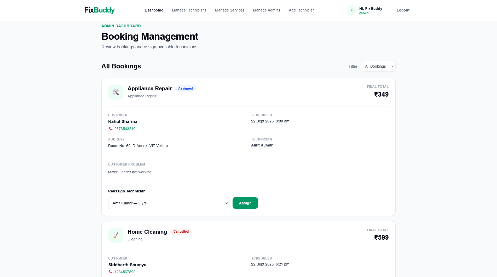
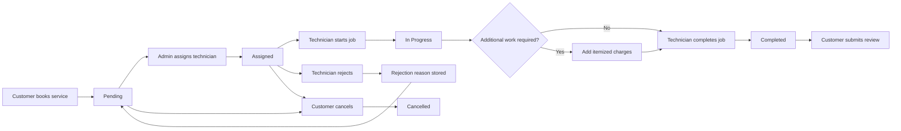
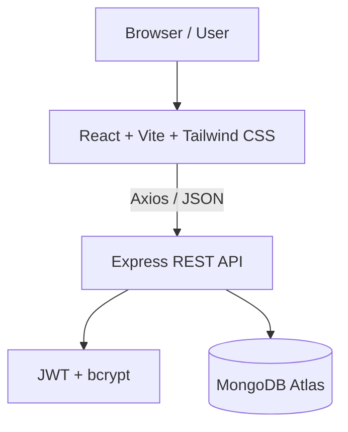

<div align="center">

# FixBuddy

### Full-Stack Home Services Booking Platform

A production-deployed MERN application for booking, managing, assigning, and completing home service requests through dedicated customer, technician, and admin workflows.

<p>
  <a href="https://fixbuddybyayush.vercel.app">
    
  </a>
  <a href="https://github.com/ayushprasad06/FixBuddy">
    
  </a>
</p>

<p>
  
  
  
  
  
  
</p>

</div>

---

## 🔗 Live Demo

### [Open FixBuddy →](https://fixbuddybyayush.vercel.app)

| Layer | Technology | Deployment |
|---|---|---|
| Frontend | React + Vite + Tailwind CSS | Vercel |
| Backend | Node.js + Express | Render |
| Database | MongoDB Atlas | MongoDB Cloud |

> The live application is the primary demonstration of the project. The screenshots below showcase the core product experience without documenting every page.

---

## 📸 Product Preview

### 🏠 Landing Page

<p align="center">
  
</p>

### 🛠️ Service Discovery

<p align="center">
  
</p>

### 📋 Service Details

<p align="center">
  
</p>

### 👤 Customer Experience

<p align="center">
  
</p>

### 🔧 Technician Experience

<p align="center">
  
</p>

### 🔧 Technician Job Details

<p align="center">
  
</p>

### 🛡️ Admin Experience

<p align="center">
  
</p>

---

## 💡 About the Project

FixBuddy is a full-stack home-services platform built around a realistic service-request lifecycle.

A customer can discover a service and create a booking without selecting a technician. An administrator manages the booking and assigns a compatible technician. The technician can then start the job, add itemized charges when additional work is required, complete the service, or reject an assigned job with a reason.

The application separates permissions and workflows for three roles:

- **Customer** — books and tracks services
- **Technician** — executes assigned jobs
- **Admin** — manages bookings, technicians, services, and administrators

---

## ✨ Core Features

### 👤 Customer

- Browse available services
- View individual service details
- Book a service with date, time, address, and problem description
- Track booking status
- View assigned technician
- Call the assigned technician
- Cancel eligible bookings
- View base service price
- View itemized additional charges
- View final service amount
- Submit a review after completion

### 🔧 Technician

- Dedicated technician dashboard
- View assigned service requests
- View customer contact information
- View service address and problem description
- Start assigned jobs
- Add itemized additional charges
- Complete service requests
- Reject assigned jobs with a mandatory reason
- Return rejected bookings to the pending queue
- Preserve rejection history

### 🛡️ Administrator

- View all bookings
- Filter bookings by status
- Assign compatible technicians
- Reassign technicians when applicable
- View customer and technician information
- Manage technicians
- Activate/deactivate technicians
- Manage services
- Add, edit, and deactivate services
- Manage administrator accounts
- Prevent removal/deactivation of the final active administrator

---

## 🔄 Booking Lifecycle



### Booking Statuses

| Status | Meaning |
|---|---|
| `pending` | Booking created and waiting for technician assignment |
| `assigned` | Technician assigned by admin |
| `in-progress` | Technician has started the job |
| `completed` | Service completed and final pricing available |
| `cancelled` | Booking cancelled where permitted |

---

## 💰 Transparent Pricing

FixBuddy keeps the original service price separate from additional work.

```text
Base Service Price
        +
Itemized Additional Charges
        =
Final Total
```

Example:

```text
AC Repair                         ₹499
Capacitor replacement             ₹550
-------------------------------------
Final Total                     ₹1,049
```

Additional work is recorded as individual charge items instead of silently modifying the original service price.

---

## 🔐 Authentication & Authorization

The backend implements:

- JWT-based authentication
- Password hashing with bcrypt
- Protected API routes
- Role-based authorization
- Customer / Technician / Admin permissions
- Authenticated API requests from the React client

```text
                    ┌──────────────┐
                    │     User     │
                    └──────┬───────┘
                           │
          ┌────────────────┼────────────────┐
          ▼                ▼                ▼
     Customer         Technician          Admin
          │                │                │
       Booking          Jobs            Management
       Reviews        Charges           Assignment
```

---

## 🏗️ Application Architecture



### Request Flow

```text
React Component
      ↓
API Service / Axios
      ↓
Express Route
      ↓
Authentication Middleware
      ↓
Authorization Middleware
      ↓
Controller
      ↓
Mongoose Model
      ↓
MongoDB Atlas
      ↓
JSON Response
      ↓
React UI
```

---

## 🧰 Tech Stack

### Frontend

| Technology | Purpose |
|---|---|
| React | Component-based UI |
| Vite | Frontend tooling and build system |
| React Router | Client-side routing |
| Tailwind CSS | Styling and responsive UI |
| Axios | API communication |

### Backend

| Technology | Purpose |
|---|---|
| Node.js | JavaScript runtime |
| Express | REST API framework |
| Mongoose | MongoDB ODM |
| JWT | Authentication |
| bcryptjs | Password hashing |
| CORS | Cross-origin API access |
| dotenv | Environment configuration |

### Database & Deployment

| Technology | Purpose |
|---|---|
| MongoDB Atlas | Cloud database |
| Vercel | Frontend deployment |
| Render | Backend deployment |
| GitHub | Source control |

---

## 📁 Project Structure

```text
FixBuddy/
│
├── client/
│   ├── public/
│   └── src/
│       ├── assets/
│       ├── components/
│       ├── pages/
│       ├── services/
│       ├── App.jsx
│       └── main.jsx
│
├── server/
│   └── src/
│       ├── config/
│       ├── controllers/
│       ├── middleware/
│       ├── models/
│       ├── routes/
│       ├── app.js
│       └── server.js
│
├── screenshots/
│   ├── admin-dashboard.png
│   ├── customer-dashboard.png
│   ├── home.png
│   ├── services.png
│   ├── service-details.png
│   ├── technician-dashboard.png
│   └── technician-job-details.png
│
├── .gitignore
└── README.md
```

---

## 🔌 API Overview

The backend exposes RESTful endpoints grouped by resource.

| Resource | Purpose |
|---|---|
| `/api/auth` | Registration and authentication |
| `/api/users` | User management |
| `/api/services` | Service discovery and management |
| `/api/technicians` | Technician profiles and management |
| `/api/bookings` | Booking lifecycle and job operations |
| `/api/reviews` | Customer reviews |

Authenticated requests use:

```http
Authorization: Bearer <JWT_TOKEN>
```

---

## ⚙️ Local Development

### 1. Clone the repository

```bash
git clone https://github.com/ayushprasad06/FixBuddy.git
cd FixBuddy
```

### 2. Install frontend dependencies

```bash
cd client
npm install
```

### 3. Configure frontend environment

Create:

```text
client/.env
```

```env
VITE_API_URL=http://localhost:5000/api
```

### 4. Install backend dependencies

```bash
cd ../server
npm install
```

### 5. Configure backend environment

Create:

```text
server/.env
```

```env
PORT=5000
MONGO_URI=your_mongodb_connection_string
JWT_SECRET=your_jwt_secret
```

### 6. Start the backend

```bash
npm run dev
```

### 7. Start the frontend

Open another terminal:

```bash
cd client
npm run dev
```

The React application will communicate with the Express REST API through the configured API base URL.

> **Security:** Never commit `.env` files or real credentials to GitHub.

---

## 🌐 Deployment

### Frontend

```text
React + Vite + Tailwind CSS
            ↓
          Vercel
            ↓
   Production Web Application
```

### Backend

```text
Node.js + Express
        ↓
      Render
        ↓
     REST API
```

### Database

```text
Express API
      ↓
   Mongoose
      ↓
 MongoDB Atlas
```

The frontend and backend are deployed separately and communicate through the production REST API.

---

## 🧪 End-to-End Workflow

A complete workflow can be tested using the three application roles:

```text
Customer
   ↓
Creates booking
   ↓
Pending
   ↓
Admin assigns technician
   ↓
Assigned
   ↓
Technician starts job
   ↓
In Progress
   ↓
Optional additional charges
   ↓
Technician completes job
   ↓
Completed
   ↓
Customer views final amount
   ↓
Customer submits review
```

### Rejection Workflow

```text
Assigned
   ↓
Technician rejects
   ↓
Reason recorded
   ↓
Technician cleared
   ↓
Booking returns to Pending
   ↓
Admin can reassign
```

---

## 🎯 What This Project Demonstrates

FixBuddy was built to demonstrate practical full-stack development concepts:

- Full-stack application architecture
- REST API design
- Authentication and authorization
- Role-based access control
- MongoDB data modeling
- React component architecture
- API integration with Axios
- CRUD operations
- Booking state management
- Itemized pricing and additional charges
- Multi-role workflows
- Production frontend/backend deployment
- Environment variable management

---

## 🛣️ Future Improvements

Potential improvements include:

- Online payment integration
- Email/SMS booking notifications
- Technician availability scheduling
- Real-time booking updates
- Location and map integration
- Advanced search and filtering
- Admin reporting and analytics
- Automated API and frontend tests
- CI/CD workflows

---

## 👨‍💻 Author

<div align="center">

### Ayush Prasad

**BCA Student • Full-Stack Developer**

<p>
  <a href="https://github.com/ayushprasad06">GitHub</a>
  •
  <a href="https://www.linkedin.com/in/ayushprasad2006">LinkedIn</a>
</p>

</div>

---

<div align="center">

### ⭐ If you found this project interesting, consider giving it a star!

Built with React, Node.js, Express and MongoDB.

</div>
